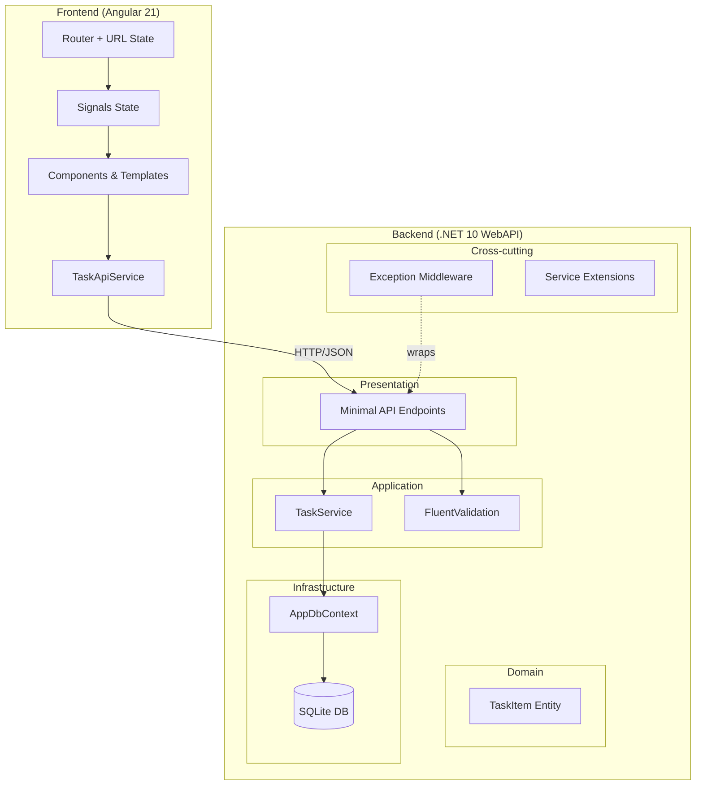
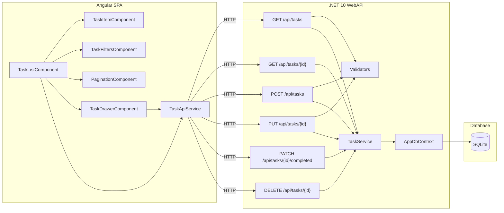
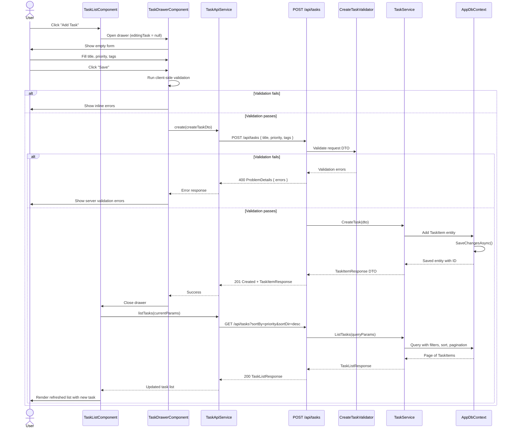

# High-Level Technical Design — Todo App (MVP)

## 1. Tech Stack and Rationale

### Backend

| Technology | Version | Purpose | Rationale |
|---|---|---|---|
| .NET | 10.0 | Runtime & WebAPI | Already scaffolded; minimal-API style keeps boilerplate low for an MVP. |
| EF Core | 10.x | ORM / Data access | First-party, excellent SQLite support, global query filters for soft delete, easy migration path to Postgres. |
| SQLite | 3.x | Database | Zero-infrastructure for dev and single-instance MVP prod. Portable file-based DB. |
| FluentValidation | 12.x | Request validation | Decouples validation logic from models; composable and testable rules. |
| Microsoft.AspNetCore.OpenApi | 10.x | OpenAPI generation | Already included; generates OpenAPI spec at `/openapi/v1.json`. |

**Deliberately omitted for MVP:**
- AutoMapper / Mapperly — manual mapping in a thin service layer is sufficient for 1‒2 entities; avoids an extra dependency.
- MediatR — vertical-slice grouping via folders is enough; no need for pipeline behaviors or CQRS in MVP.
- Caching — pagination + SQLite keeps queries fast; no caching layer justified yet.

### Frontend

| Technology | Version | Purpose | Rationale |
|---|---|---|---|
| Angular | 21.x | SPA framework | Requirements mandate Angular with standalone components + signals. |
| Tailwind CSS | 4.x | Utility-first styling | Requirements specify Tailwind default theme. Already configured with PostCSS. |
| Vitest | 4.x | Unit testing | Already configured in `angular.json` via `@angular/build:unit-test`. Fast, native ESM. |
| Bun | 1.3.x | Package manager / runtime | Already configured as project package manager. |

**Deliberately omitted for MVP:**
- Dedicated UI component library — Tailwind utility classes + custom components keeps the bundle small.
- NgRx / state management library — Angular signals + `computed()` handle the local state needs.
- Playwright / Cypress — manual UI checklist for MVP; E2E can be added post-MVP.

### Tooling

| Tool | Purpose |
|---|---|
| `dotnet ef` CLI | EF Core migrations |
| Vitest | Angular unit tests |
| `xUnit` + `Microsoft.AspNetCore.Mvc.Testing` | Backend unit + integration tests |
| Prettier | Frontend code formatting (already configured) |

---

## 2. Architecture and Layering

### 2.1 Backend Layers

The backend uses a **vertical-slice-inspired layout within a single project**, organized by responsibility folders. Dependencies flow inward: Presentation → Application → Infrastructure.

| Layer | Folder(s) | Responsibilities |
|---|---|---|
| **Presentation** | `Endpoints/` | Minimal API endpoint definitions, request/response DTOs, parameter binding, OpenAPI metadata. |
| **Application** | `Services/` | Business logic, orchestration, validation invocation, DTO ↔ entity mapping. |
| **Domain** | `Models/` | Entity definitions (`TaskItem`), enums (`Priority`), value objects. No dependencies on other layers. |
| **Infrastructure** | `Data/` | `AppDbContext`, entity configurations, migrations, repository abstractions (optional). |
| **Cross-cutting** | `Middleware/`, `Extensions/` | Exception-to-ProblemDetails middleware, service registration extensions, logging config. |
| **Validation** | `Validators/` | FluentValidation validators for request DTOs. |

**Dependency injection plan:**
- `AppDbContext` registered as scoped via `AddDbContext<AppDbContext>`.
- `TaskService` registered as scoped (depends on `AppDbContext`).
- FluentValidation validators registered via `AddValidatorsFromAssembly`.
- Exception middleware added as first middleware in the pipeline.

### 2.2 Frontend Layers

| Layer | Folder(s) | Responsibilities |
|---|---|---|
| **Feature** | `app/tasks/` | Task list page, task drawer component, task item component. |
| **Core** | `app/core/` | `TaskApiService` (HTTP client), models/interfaces, interceptors. |
| **Shared** | `app/shared/` | Reusable UI components (pagination, search input, filter chips, drawer shell). |

**Routing:** Single lazy-loaded route (`/tasks`) that serves as the app's main page. App root redirects to `/tasks`.

### 2.3 Layered Architecture Diagram



---

## 3. Data Model and Persistence

### 3.1 Entity: `TaskItem`

> Named `TaskItem` to avoid collision with `System.Threading.Tasks.Task`.

| Field | Type | Constraints | Notes |
|---|---|---|---|
| `Id` | `Guid` | PK, generated on create | Client-friendly, avoids sequential exposure. |
| `Title` | `string` | Required, max 100 chars | Indexed for search (`LIKE '%term%'`). |
| `Description` | `string?` | Optional, max 1000 chars | |
| `DueDate` | `DateTimeOffset?` | Optional | Stored with offset for deterministic overdue checks. |
| `Priority` | `Priority` (enum) | `Low = 0, Medium = 1, High = 2` | Default `Medium`. Stored as int. |
| `Tags` | `List<string>` | 0..5 items | Stored as JSON column (SQLite JSON1 / EF value converter). |
| `IsCompleted` | `bool` | Default `false` | Toggled via PATCH. |
| `DeletedAt` | `DateTimeOffset?` | Null = active | Soft-delete marker. Non-null means deleted. |
| `CreatedAt` | `DateTimeOffset` | Set on creation | Audit field. |
| `UpdatedAt` | `DateTimeOffset` | Set on every mutation | Audit field. |
| `RowVersion` | `byte[]` | Concurrency token | EF Core optimistic concurrency via SQLite trigger or `xmin` on Postgres. |

### 3.2 EF Core Configuration

```csharp
public class TaskItemConfiguration : IEntityTypeConfiguration<TaskItem>
{
    public void Configure(EntityTypeBuilder<TaskItem> builder)
    {
        builder.HasKey(t => t.Id);
        builder.Property(t => t.Title).IsRequired().HasMaxLength(100);
        builder.Property(t => t.Description).HasMaxLength(1000);
        builder.Property(t => t.Priority).HasConversion<int>();
        builder.Property(t => t.Tags).HasConversion(
            v => JsonSerializer.Serialize(v, (JsonSerializerOptions?)null),
            v => JsonSerializer.Deserialize<List<string>>(v, (JsonSerializerOptions?)null)!
        );
        builder.Property(t => t.RowVersion).IsRowVersion();

        // Global query filter: exclude soft-deleted items
        builder.HasQueryFilter(t => t.DeletedAt == null);

        // Indexes
        builder.HasIndex(t => t.Title);
        builder.HasIndex(t => t.Priority);
        builder.HasIndex(t => t.DeletedAt);
        builder.HasIndex(t => t.DueDate);
    }
}
```

### 3.3 Migration Strategy

- Use `dotnet ef migrations add <Name>` to generate migrations.
- SQLite for development and initial MVP production (single-instance).
- Avoid SQLite-specific SQL in migrations; use EF abstractions to stay portable.
- **Postgres migration path:** swap the provider, adjust `RowVersion` to use `xmin`, re-run migrations. Tags column can use native `jsonb`.

---

## 4. API Design Conventions

### 4.1 Endpoints

| Method | Route | Purpose | Story |
|---|---|---|---|
| `GET` | `/api/tasks` | List tasks (paginated, filterable, searchable, sortable) | US-01, US-06‒US-10 |
| `GET` | `/api/tasks/{id}` | Get single task | US-03 (populate edit form) |
| `POST` | `/api/tasks` | Create task | US-02 |
| `PUT` | `/api/tasks/{id}` | Full update task | US-03 |
| `PATCH` | `/api/tasks/{id}/completed` | Toggle completion status | US-04 |
| `DELETE` | `/api/tasks/{id}` | Soft delete task | US-05 |

### 4.2 Query Parameters (`GET /api/tasks`)

| Param | Type | Default | Notes |
|---|---|---|---|
| `q` | `string?` | `null` | Title search (case-insensitive `LIKE`). |
| `priority` | `string?` | `null` | Filter: `low`, `medium`, `high`. |
| `tag` | `string[]` | `[]` | Repeated param `?tag=Home&tag=Work` → OR semantics. |
| `sortBy` | `string` | `priority` | `priority`, `dueDate`, `createdAt`. |
| `sortDir` | `string` | `desc` | `asc` or `desc`. |
| `page` | `int` | `1` | 1-based page number. |
| `pageSize` | `int` | `10` | Max 100; > 100 returns HTTP 400. |

**Response shape:**

```json
{
  "items": [ /* TaskItem DTOs */ ],
  "page": 1,
  "pageSize": 10,
  "totalCount": 42,
  "totalPages": 5
}
```

### 4.3 Error Handling — RFC 7807 ProblemDetails

All error responses use `application/problem+json`:

| Status | When |
|---|---|
| `400 Bad Request` | Validation failures (with `errors` extension), `pageSize > 100`. |
| `404 Not Found` | Task ID not found (or soft-deleted). |
| `409 Conflict` | Concurrency conflict (`RowVersion` mismatch). |
| `500 Internal Server Error` | Unhandled exceptions (detail hidden in production). |

**Validation errors** follow the ProblemDetails `errors` extension:

```json
{
  "type": "https://tools.ietf.org/html/rfc9110#section-15.5.1",
  "title": "One or more validation errors occurred.",
  "status": 400,
  "errors": {
    "Title": ["'Title' must not be empty."],
    "Tags": ["A task can have at most 5 tags."]
  }
}
```

### 4.4 Versioning

No API versioning for MVP. All endpoints live under `/api/`. If versioning becomes necessary post-MVP, prefix with `/api/v2/`.

### 4.5 OpenAPI 3.1 Specification

```yaml
openapi: 3.1.0
info:
  title: Todo API
  description: MVP Todo application API
  version: 1.0.0

servers:
  - url: http://localhost:5276
    description: Development

paths:
  /api/tasks:
    get:
      operationId: listTasks
      summary: List tasks with pagination, filtering, search, and sorting
      parameters:
        - name: q
          in: query
          schema:
            type: string
          description: Search by title (case-insensitive)
        - name: priority
          in: query
          schema:
            type: string
            enum: [low, medium, high]
          description: Filter by priority
        - name: tag
          in: query
          schema:
            type: array
            items:
              type: string
          style: form
          explode: true
          description: Filter by tags (OR logic)
        - name: sortBy
          in: query
          schema:
            type: string
            enum: [priority, dueDate, createdAt]
            default: priority
        - name: sortDir
          in: query
          schema:
            type: string
            enum: [asc, desc]
            default: desc
        - name: page
          in: query
          schema:
            type: integer
            minimum: 1
            default: 1
        - name: pageSize
          in: query
          schema:
            type: integer
            minimum: 1
            maximum: 100
            default: 10
      responses:
        '200':
          description: Paginated list of tasks
          content:
            application/json:
              schema:
                $ref: '#/components/schemas/TaskListResponse'
        '400':
          description: Invalid query parameters
          content:
            application/problem+json:
              schema:
                $ref: '#/components/schemas/ProblemDetails'
    post:
      operationId: createTask
      summary: Create a new task
      requestBody:
        required: true
        content:
          application/json:
            schema:
              $ref: '#/components/schemas/CreateTaskRequest'
      responses:
        '201':
          description: Task created
          content:
            application/json:
              schema:
                $ref: '#/components/schemas/TaskItemResponse'
        '400':
          description: Validation error
          content:
            application/problem+json:
              schema:
                $ref: '#/components/schemas/ValidationProblemDetails'

  /api/tasks/{id}:
    parameters:
      - name: id
        in: path
        required: true
        schema:
          type: string
          format: uuid
    get:
      operationId: getTask
      summary: Get a single task by ID
      responses:
        '200':
          description: Task found
          content:
            application/json:
              schema:
                $ref: '#/components/schemas/TaskItemResponse'
        '404':
          description: Task not found
          content:
            application/problem+json:
              schema:
                $ref: '#/components/schemas/ProblemDetails'
    put:
      operationId: updateTask
      summary: Update an existing task
      requestBody:
        required: true
        content:
          application/json:
            schema:
              $ref: '#/components/schemas/UpdateTaskRequest'
      responses:
        '200':
          description: Task updated
          content:
            application/json:
              schema:
                $ref: '#/components/schemas/TaskItemResponse'
        '400':
          description: Validation error
          content:
            application/problem+json:
              schema:
                $ref: '#/components/schemas/ValidationProblemDetails'
        '404':
          description: Task not found
          content:
            application/problem+json:
              schema:
                $ref: '#/components/schemas/ProblemDetails'
        '409':
          description: Concurrency conflict
          content:
            application/problem+json:
              schema:
                $ref: '#/components/schemas/ProblemDetails'
    delete:
      operationId: deleteTask
      summary: Soft delete a task
      responses:
        '204':
          description: Task deleted
        '404':
          description: Task not found
          content:
            application/problem+json:
              schema:
                $ref: '#/components/schemas/ProblemDetails'

  /api/tasks/{id}/completed:
    parameters:
      - name: id
        in: path
        required: true
        schema:
          type: string
          format: uuid
    patch:
      operationId: toggleTaskCompleted
      summary: Toggle task completion status
      requestBody:
        required: true
        content:
          application/json:
            schema:
              $ref: '#/components/schemas/ToggleCompletedRequest'
      responses:
        '200':
          description: Completion status toggled
          content:
            application/json:
              schema:
                $ref: '#/components/schemas/TaskItemResponse'
        '404':
          description: Task not found
          content:
            application/problem+json:
              schema:
                $ref: '#/components/schemas/ProblemDetails'
        '409':
          description: Concurrency conflict
          content:
            application/problem+json:
              schema:
                $ref: '#/components/schemas/ProblemDetails'

components:
  schemas:
    Priority:
      type: string
      enum: [low, medium, high]

    CreateTaskRequest:
      type: object
      required: [title]
      properties:
        title:
          type: string
          maxLength: 100
        description:
          type: string
          maxLength: 1000
        dueDate:
          type: string
          format: date-time
        priority:
          $ref: '#/components/schemas/Priority'
          default: medium
        tags:
          type: array
          items:
            type: string
          maxItems: 5

    UpdateTaskRequest:
      type: object
      required: [title, rowVersion]
      properties:
        title:
          type: string
          maxLength: 100
        description:
          type: string
          maxLength: 1000
        dueDate:
          type: string
          format: date-time
        priority:
          $ref: '#/components/schemas/Priority'
        tags:
          type: array
          items:
            type: string
          maxItems: 5
        rowVersion:
          type: string
          format: byte
          description: Base64-encoded concurrency token

    ToggleCompletedRequest:
      type: object
      required: [isCompleted, rowVersion]
      properties:
        isCompleted:
          type: boolean
        rowVersion:
          type: string
          format: byte
          description: Base64-encoded concurrency token

    TaskItemResponse:
      type: object
      properties:
        id:
          type: string
          format: uuid
        title:
          type: string
        description:
          type: string
        dueDate:
          type: string
          format: date-time
        priority:
          $ref: '#/components/schemas/Priority'
        tags:
          type: array
          items:
            type: string
        isCompleted:
          type: boolean
        createdAt:
          type: string
          format: date-time
        updatedAt:
          type: string
          format: date-time
        rowVersion:
          type: string
          format: byte

    TaskListResponse:
      type: object
      properties:
        items:
          type: array
          items:
            $ref: '#/components/schemas/TaskItemResponse'
        page:
          type: integer
        pageSize:
          type: integer
        totalCount:
          type: integer
        totalPages:
          type: integer

    ProblemDetails:
      type: object
      properties:
        type:
          type: string
        title:
          type: string
        status:
          type: integer
        detail:
          type: string
        instance:
          type: string

    ValidationProblemDetails:
      allOf:
        - $ref: '#/components/schemas/ProblemDetails'
        - type: object
          properties:
            errors:
              type: object
              additionalProperties:
                type: array
                items:
                  type: string
```

---

## 5. UI Architecture (Angular SPA)

### 5.1 Module / Component Breakdown

```
src/app/
├── app.ts                   # Root component (router-outlet + layout shell)
├── app.routes.ts             # Route config with lazy loading
├── app.config.ts             # provideHttpClient, provideRouter, etc.
├── core/
│   ├── models/
│   │   ├── task.model.ts     # TaskItem, Priority, TaskListResponse interfaces
│   │   └── query-params.model.ts  # TaskQueryParams interface
│   ├── services/
│   │   └── task-api.service.ts    # HttpClient wrapper for /api/tasks
│   └── interceptors/
│       └── error.interceptor.ts   # Global HTTP error handling
├── tasks/
│   ├── task-list/
│   │   ├── task-list.ts      # Main page: list + filters + search + pagination
│   │   ├── task-list.html
│   │   └── task-list.css
│   ├── task-item/
│   │   ├── task-item.ts      # Single task row with actions
│   │   ├── task-item.html
│   │   └── task-item.css
│   ├── task-drawer/
│   │   ├── task-drawer.ts    # Right-side drawer: create + edit form
│   │   ├── task-drawer.html
│   │   └── task-drawer.css
│   └── task-filters/
│       ├── task-filters.ts   # Search input, priority dropdown, tag chips
│       ├── task-filters.html
│       └── task-filters.css
└── shared/
    ├── components/
    │   ├── drawer/            # Generic animated right-side drawer shell
    │   ├── pagination/        # Page navigation controls
    │   └── confirm-dialog/    # Delete confirmation
    └── pipes/
        └── relative-date.pipe.ts  # Optional: format due dates
```

### 5.2 State Management with Signals

The `TaskListComponent` owns the primary state:

```
tasks = signal<TaskItem[]>([])
loading = signal(false)
error = signal<string | null>(null)
totalCount = signal(0)
queryParams = signal<TaskQueryParams>(defaultParams)

// Derived
totalPages = computed(() => Math.ceil(this.totalCount() / this.queryParams().pageSize))
isEmpty = computed(() => !this.loading() && this.tasks().length === 0 && !this.error())
```

**URL ↔ Signal sync:** The component reads `ActivatedRoute.queryParams` on init and writes back via `Router.navigate([], { queryParams })` on every filter/search/page change. This ensures:
- Refreshing the page restores the exact list state (US-09).
- Browser back/forward navigates through filter history.

### 5.3 Create / Edit Flow (US-02 / US-03)

1. User clicks **"Add Task"** → `drawerOpen = signal(true)`, `editingTask = signal(null)`.
2. User clicks **"Edit"** on a row → `TaskApiService.get(id)` fetches the task → `editingTask.set(task)` → drawer opens with prefilled reactive form.
3. Form uses `FormGroup` with validators matching backend constraints.
4. On **Save** → `TaskApiService.create(dto)` or `TaskApiService.update(id, dto)` → on success, drawer closes, list refreshes via re-fetch.
5. On **Cancel** → drawer closes, form resets.

### 5.4 Responsive Layout

- **Desktop (≥1024px):** Side-by-side list + drawer (drawer overlays or pushes).
- **Tablet (768px–1023px):** Full-width list; drawer slides over as overlay with backdrop.
- Tailwind breakpoints (`md:`, `lg:`) handle layout switching. No mobile-specific layout required for MVP.

### 5.5 Accessibility

- Drawer uses `role="dialog"`, `aria-modal="true"`, focus trap on open, return focus on close.
- Task list is a semantic `<table>` or `<ul>` with labelled columns.
- All interactive elements are keyboard-navigable (`Tab`, `Enter`, `Escape` to close drawer).
- Overdue styling uses both color and an icon/text label (not color alone) to meet WCAG AA.
- Form validation errors linked via `aria-describedby`.

---

## 6. Cross-Cutting Concerns and Best Practices

### 6.1 Validation

**Backend:**
- FluentValidation validators per request DTO (`CreateTaskValidator`, `UpdateTaskValidator`).
- Validation invoked in the endpoint (or via an endpoint filter) before reaching the service layer.
- Failures mapped to `ValidationProblemDetails` (400).

**Frontend:**
- Angular reactive form validators mirror backend rules (`Validators.required`, `Validators.maxLength(100)`, custom tag count validator).
- Client-side validation is for UX; the backend is the authoritative boundary.

### 6.2 Error Middleware

A custom exception-handling middleware converts domain/infrastructure exceptions to ProblemDetails:

| Exception | HTTP Status | Detail |
|---|---|---|
| `TaskNotFoundException` | 404 | "Task with ID {id} was not found." |
| `DbUpdateConcurrencyException` | 409 | "The task was modified by another request." |
| `ValidationException` (FluentValidation) | 400 | Validation errors dictionary. |
| Unhandled `Exception` | 500 | Generic message (no stack trace in production). |

### 6.3 Logging and Tracing

- **Structured logging** via built-in `ILogger<T>` + JSON console sink (default in .NET 10).
- Log key operations: task created/updated/deleted, validation failures, unhandled exceptions.
- **Correlation ID:** Add middleware that reads/generates `X-Correlation-Id` header and stores it in `HttpContext.Items` + log scope. Enables request tracing across entries.
- No external logging infrastructure for MVP (stdout/console is sufficient).

### 6.4 Security Headers and CORS

- **CORS:** Configure to allow only the Angular dev server origin (`http://localhost:4200`) in development. In production, same-origin (SPA served from same host or behind reverse proxy) — no CORS needed.
- **Security headers middleware:** `X-Content-Type-Options: nosniff`, `X-Frame-Options: DENY`, `Referrer-Policy: strict-origin-when-cross-origin`. These are low-effort, high-value defaults.
- **HTTPS redirection** is already configured in `Program.cs`.
- **No authentication** for MVP (per requirements).

### 6.5 Health Endpoint

Register a basic health check that verifies SQLite connectivity:

```csharp
builder.Services.AddHealthChecks()
    .AddDbContextCheck<AppDbContext>();
app.MapHealthChecks("/health");
```

### 6.6 Rate and Size Limits

- **Request body size:** ASP.NET default (~28 MB) is fine; no file uploads to worry about.
- **Page size limit:** Validated in query params — `pageSize > 100` returns 400.
- **Rate limiting:** Not required for MVP (no auth, small scale). Can be added via `Microsoft.AspNetCore.RateLimiting` post-MVP.

### 6.7 Performance

- **Indexes** on `Title`, `Priority`, `DueDate`, `DeletedAt` cover all query/filter/sort paths.
- **Pagination** at the DB level (`Skip`/`Take`) prevents loading full data sets.
- **N+1 avoidance:** Tags are stored as a JSON column on the entity (no child table), so a single query fetches everything.
- **No caching** for MVP — queries are simple and dataset is small.
- **`AsNoTracking()`** on all read queries to avoid unnecessary change tracking overhead.

---

## 7. Testing Strategy

### 7.1 Backend Testing

| Level | Framework | What to Test |
|---|---|---|
| **Unit** | xUnit + FluentAssertions | `TaskService` business logic (mapping, sort, filter composition), FluentValidation validators, edge cases (empty tags, null due date). |
| **Integration** | xUnit + `WebApplicationFactory` + SQLite in-memory | Full endpoint round-trips: CRUD operations, query param combinations, ProblemDetails responses (400, 404, 409), pagination boundaries, soft-delete exclusion. |

**Key integration test scenarios:**
- Create task → verify 201 + response body.
- Create task with invalid data → verify 400 + `errors` dictionary.
- List tasks with default sort → verify priority DESC, due date DESC ordering.
- List with `pageSize=101` → verify 400.
- Soft delete → verify task excluded from subsequent GET list.
- Toggle completion → verify IsCompleted toggled.
- Concurrent update → verify 409 response.

### 7.2 Frontend Testing

| Level | Framework | What to Test |
|---|---|---|
| **Unit** | Vitest | `TaskApiService` (mock HttpClient), signal state logic in components, form validation rules, computed overdue logic. |

**Key unit test scenarios:**
- `TaskApiService` constructs correct URLs with query params.
- Form validation rejects empty title, >100 char title, >5 tags.
- Overdue `computed()` returns true when `dueDate < now` and `!isCompleted`.
- Query param signal sync produces correct URL params.

### 7.3 Manual UI Checklist (MVP)

- [ ] List loads with default sort, shows 10 items.
- [ ] Create drawer opens, form validates, task appears in list.
- [ ] Edit drawer prefills values, saves, list updates.
- [ ] Toggle completion changes visual state, can be reverted.
- [ ] Delete removes task from list, survives refresh.
- [ ] Search filters by title, clear restores list.
- [ ] Priority filter works, remove filter restores list.
- [ ] Tag filter with multiple tags uses OR logic.
- [ ] Pagination navigates pages, page size fixed at 10.
- [ ] URL reflects all current filters; refresh restores state.
- [ ] Loading spinner shown during fetch.
- [ ] Empty state shown when no tasks match.
- [ ] Error state shown on network failure with retry button.
- [ ] Overdue tasks styled differently (incomplete + past due).
- [ ] Drawer is keyboard-navigable, escape closes it.
- [ ] Works on tablet viewport (768px).

---

## 8. Diagrams

### 8.1 Component Diagram



### 8.2 Sequence Diagram — US-02: Create Task Flow



### 8.3 Backend Folder Structure

```
Todo.API/
├── Program.cs                          # App builder, middleware, endpoint mapping
├── appsettings.json
├── Data/
│   ├── AppDbContext.cs                 # DbContext with DbSet<TaskItem>
│   ├── Configurations/
│   │   └── TaskItemConfiguration.cs    # Entity type configuration
│   └── Migrations/                     # EF Core migrations
├── Endpoints/
│   └── TaskEndpoints.cs                # Minimal API route group /api/tasks
├── Extensions/
│   └── ServiceCollectionExtensions.cs  # DI registration helpers
├── Middleware/
│   └── ExceptionHandlingMiddleware.cs  # Maps exceptions → ProblemDetails
├── Models/
│   ├── TaskItem.cs                     # Domain entity
│   └── Priority.cs                     # Enum: Low, Medium, High
├── Services/
│   ├── TaskService.cs                  # Business logic + orchestration
│   └── Dtos/
│       ├── CreateTaskRequest.cs
│       ├── UpdateTaskRequest.cs
│       ├── ToggleCompletedRequest.cs
│       ├── TaskItemResponse.cs
│       ├── TaskListResponse.cs
│       └── TaskQueryParams.cs
└── Validators/
    ├── CreateTaskValidator.cs
    ├── UpdateTaskValidator.cs
    └── TaskQueryParamsValidator.cs
```

---

## 9. Key Design Decisions and MVP Simplifications

| Decision | Rationale |
|---|---|
| **Single project, folder-based slicing** | One entity (`TaskItem`) does not justify multi-project solutions. Folders provide enough separation. |
| **Minimal APIs over controllers** | Less ceremony for CRUD endpoints; groups via `MapGroup("/api/tasks")`. |
| **Tags as JSON column** | Avoids a `Tag` entity + join table. OR-filter queries use `LIKE` or JSON functions. Acceptable for MVP data volumes. |
| **`Guid` primary keys** | Safe for URL exposure, no enumeration risk, works across DB providers. |
| **Manual DTO mapping** | One entity with ~10 fields does not justify a mapping library. A static `MapToResponse()` extension method is sufficient and explicit. |
| **No repository pattern** | EF Core `DbContext` is already a Unit of Work + Repository. Adding an abstraction layer for 1 entity is over-engineering. The service layer queries `DbContext` directly. |
| **Global query filter for soft delete** | Ensures deleted tasks are excluded from all queries by default. Use `.IgnoreQueryFilters()` only if cleanup job needs to find expired items. |
| **Signals over NgRx** | One page, one list, simple state. Signals + `computed()` are sufficient. No action/reducer boilerplate needed. |
| **No SSR / pre-rendering** | Internal tool with no SEO requirements. Client-side rendering only. |
